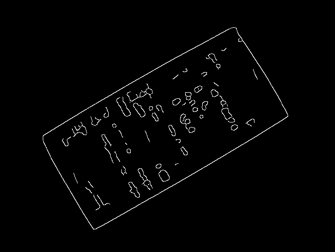

OpenCV document scanner in Haskell
==================================

Rewrite of [OpenCV document scanner](https://github.com/mryndzionek/scanner) in Haskell.
Some things turned out to be tricky. Some functions are missing from Haskell [OpenCV bindings](http://hackage.haskell.org/package/opencv)
and were replaced with functions from [friday](http://hackage.haskell.org/package/friday) library.

License
-------
  - BSD3

Contact
-------
If you have questions, contact Mariusz Ryndzionek at:

<mryndzionek@gmail.com>
